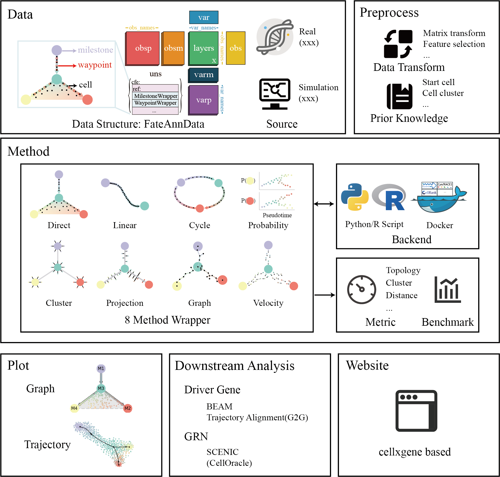

# CellFateExplorer: An integrated platform for exploring cell fate

[](https://github.com/HuangDDU/CellFateExplorer/actions/workflows/test.yml)
[](https://cellfateexplorer.readthedocs.io/en/latest/)

**Cell Fate Explorer(cfe)** is a integration platform for *inferring*, *visualizing* and *benchmarking* cell fate trajectory for single-cell RNA-seq data.

## Framework



## Installation

> The installation will be simplified when Pypi package is released in the near future.

1. Clone the repository and enter the directory.
2. Create a conda environment and install the dependencies by running the following commands.

    ```bash
    conda create -n cfe python=3.10.15
    conda activate cfe
    pip install -r requirements.txt
    ```

3. Add the now working dir into python package path.
   - For Linux (such as working dir: /home/huang/CellFateExplorer)

     ```bash
     export PYTHONPATH="$PYTHONPATH:/home/haung/CellFateExplorer"
     ```

   - For Windows (such as working dir: D:\CellFateExplorer)

     ```cmd
     setx PYTHONPATH "%PYTHONPATH%;D:\CellFateExplorer"
     ```

   - If you use VSCode, you should create `.env` in working dir for jupyter notebook python package search as following.
     
     ```txt
     PYTHONPATH=/home/haung/CellFateExplorer
     ```

4. Other installation requirements:
   - R and rpy2 are required.
   - If you want to use docker container as backend, you need to install docker beforehand.
   - install conda package

        ```bash
        conda install pygraphviz
        ```

## Quick Start

You can run the [quickstart.ipynb](https://cellfateexplorer.readthedocs.io/en/latest/tutorial/quickstart/) using jupyter noboker to learn the basic function of tools quickly.

## Project shedule

- [x] Main framework code
- [x] Document construction: intruction, tutorial, API
- [ ] [🔗](./docs/shedule/data.md)Data module: FateAnnData data structure, data collection.
- [ ] [🔗](./docs/shedule/method.md)Methods module: 3 backend, trajectory methods for 8 wrapper.
- [ ] [🔗](./docs/shedule/benchmark.md)Benchmark: comprehensive metric and benchmark.
- [ ] [🔗](./docs/shedule/plot.md)Plot: beautiful plot.
- [ ] [🔗](./docs/shedule/downstream_analysis.md)Downstream analysis module: driver gene, GRN.
- [ ] [🔗](./docs/shedule/website.md)Website module: trajectory method selection and result visualization based cellxgene.

## Document

1. Links: For [`User`](https://cellfateexplorer-cellfateexplorer.readthedocs-hosted.com/en/latest/api/), for [`Developer`](https://cellfateexplorer-cellfateexplorer.readthedocs-hosted.com/en/latest/api/)

2. If you want to build the docs locally, run the following command in now conda environment.

    ```bash
    pip install -r docs/requirements.txt
    mkdocs serve
    ```
